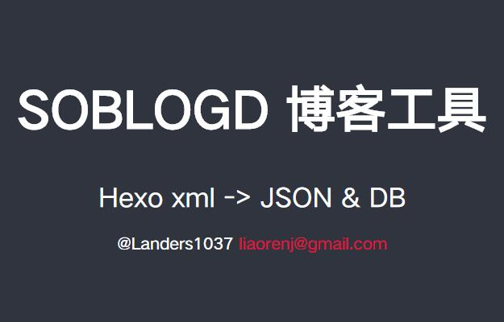
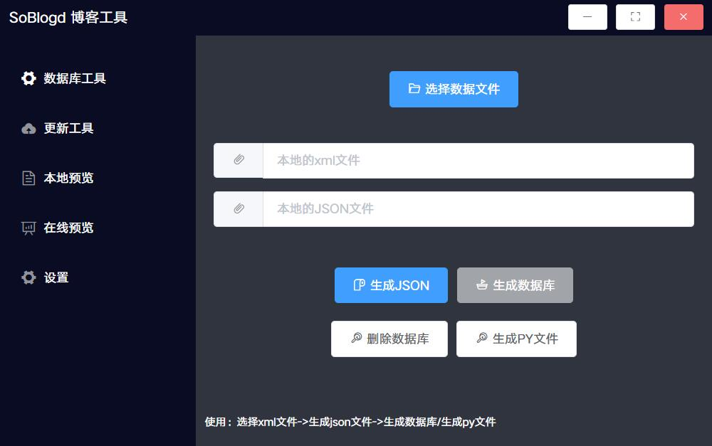

# soblogd
自用的Hexo博客索引转换工具

一个简单的让你由Hexo静态博客发布工具，转移至其他动态博客系统的工具的示例

### 依赖

使用electron6.0+，vueCLI@4.3.0

使用前提，hexo博客中开启博文模板功能，也就是md文件头部的yaml格式字符串。

本示例系统支持提取author，time，tags，title，abstract等属性

### 编译

```bash
yarn install
yarn run electron:build
```

### 使用

安装**soblogd.exe**文件，在桌面创建相应的目录`blog_opt`

目录下的`posts`文件夹内存放博文md文件，目录下存放由Hexo生成的`search.xml`文件





**工作原理**

在操作页面点击生成json文件，默认寻找`blog_opt/serach.xml`文件，你可以选择本地文件路径并传入。

生成的json文件主要内容为文章标题，文章文件名，日期，摘要等

根据json文件，点击生成数据库即可将格式化的数据写入数据库内，生成博客索引表

点击生成数据库时默认会读取本地posts目录下的文章，根据json文件内的文件名读取文件内容并写入数据库，存储为文章内容表，同时根据标签信息生成标签表。

除此以外，还能使用简单的数据库迁移功能更新数据库内的数据，需要保证md文件存在

### 功能介绍

从Hexo生成的博客索引`xml`文件转换为标准`JSON`

将本地的posts目录的全部markdown文件生成为支持`sqlite3`的数据库文件

更新需要的数据字段，UV，博文，标签

其他功能

### 示例

本程序只是自用的博客数据迁移工具，因为我原本的文章由Hexo编写生成。

部分特性可以通过Hexo的文章模板修改，同时对后端的数据库操作工具进行修改。

数据库工具本质上是一个CLI工具，可以单独使用命令行运行，使用图形化操作也只是对命令行做了封装。